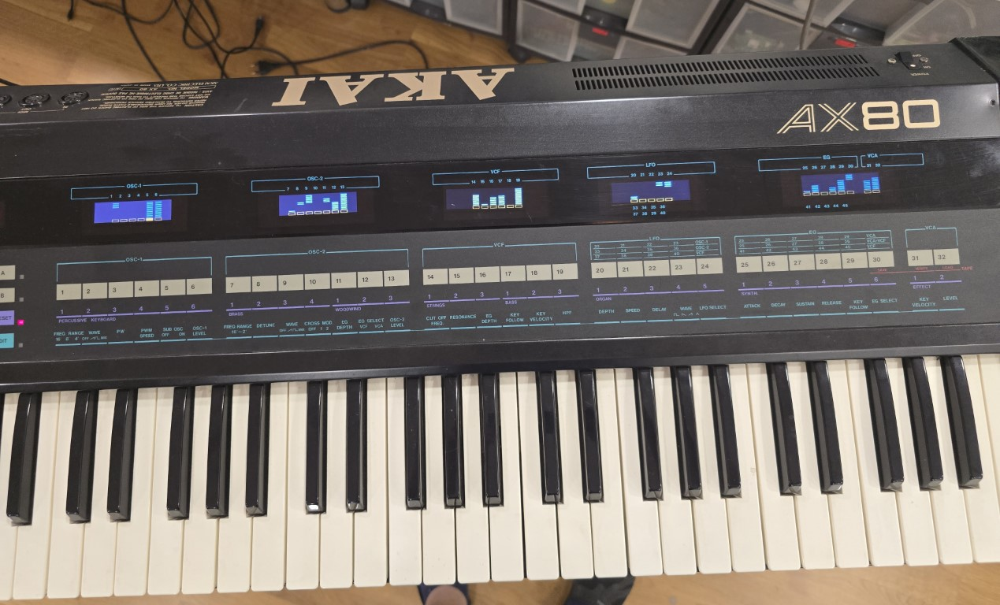

# This project was created to emulate the circuitry and displays used in the Akai AX-80 Polysynth.

I recently purchased an Akai AX-80 synthesiser with a broken DCO2 display and 110V from the USA. 

Based on my previous work with the AX-80 processor board and 2" OLED displays I wanted to create a display as close to the original.

I found a 2.52" ST7789 SPI display on AliExpress which was very inexpensive and gave a viewing window almost identical to the 9 column displays of the AX-80 VCD displays. 

All I had to do was convert my decoding logic onto two boards to replace the existing display boards and line up the OLEDs so they matched the existing parameter windows.

The screen has a resolution of 284x76 which can easily accomodate the 13 blocks x 9 columns of the original VFD displays, as these were colour I was able to emulate the orange tab at the bottom of each column and the blue column itself. The original VCD had two lines per row, meaning that when a row was illuminated you would see two lines, this was a limitation of the display, so I made the blocks solid as the column built.

The schematics show the decoder logic and level conversion from 5V to 3.3v of the original signals, this generates 32 interrupt lines which can be read by 5 ESP32 boards, the 13 address lines carry the segments to be displayed, I simply capture these with a pair of shift registers every time an interrupt is received and display it on the screen, Each ESP-32 is designed to display upto 8 columns like the original AX-80 VFD displays, but between 5 and 8 are used on each display depending on which section of the synth is it being used for. Any unused interrupts can be tied to +3.3v. This makes the code generic for each screen you emulate and just by changing LABEL_SET you can set it for screen 1-5 (0-4). I used ESP32-Dev boards because they are cheap and easily accessible, I have never used them before, but they have Arduino compatibility which I required for the RoxMux library used to capture the 13 address lines. 

I have updated the code slightly from previous as I have 9 columns and upto 8 interrupts per display to handle, I now have an array with defines if a column is blank (-1) and which interrupt pin on the ESP32 will be used for the column, this in effect simplifies the wiring as you can just start at interrupt pin 0 on each board and define where they are on the display in the array, this method allowed me to create the 9 column display of the VCA section with a gap between the last two columns.

Videos of the Displays in action

[https://youtu.be/0UIXME1TG3U](https://youtu.be/SGEmNIH-Si8)

[https://youtu.be/lRL6-849DsE](https://youtu.be/7jF0m-6hbDc)
